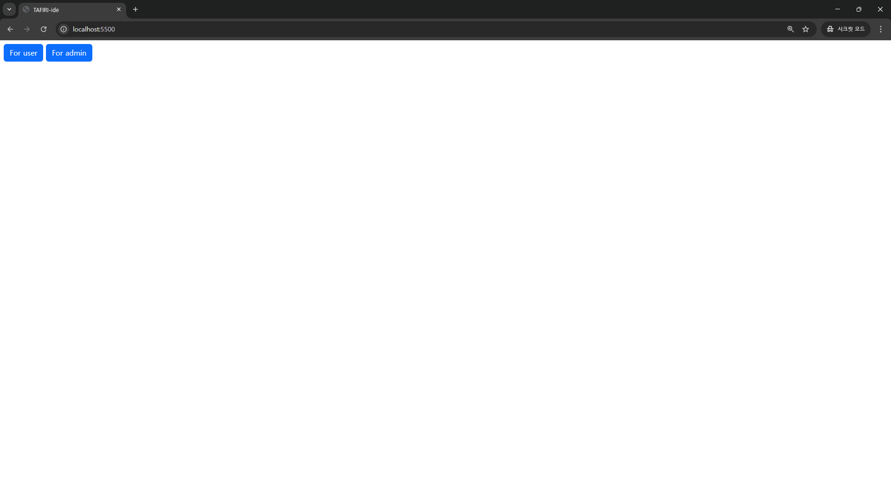
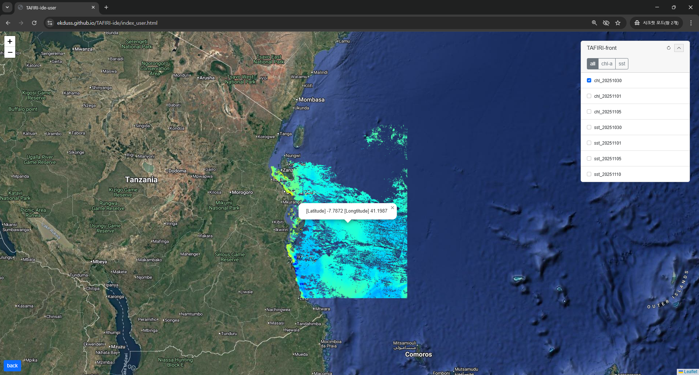
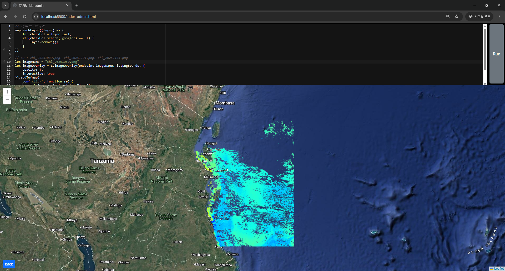

## TAFIRI-ide
* https://ekduss.github.io/TAFIRI-ide/

  

### Main

* For User 버튼 : 일반 사용자를 위한 웹페이지
* For Admin 버튼 : 관리자(예:연구원)를 위한 웹페이지

  

### User

* 우측 레이어를 통해 영상 이미지 확인
* 영상 이미지를 클릭하면 해당 경위도 정보 출력
* 하단 좌측 버튼으로 메인 페이지로 이동

  

### Admin

* 상단 레이어로 javascript 코드 작성
* Run 버튼 : 작성한 코드 실행하여 아래 지도 레이어에서 검토
* 하단 좌측 버튼으로 메인 페이지로 이동